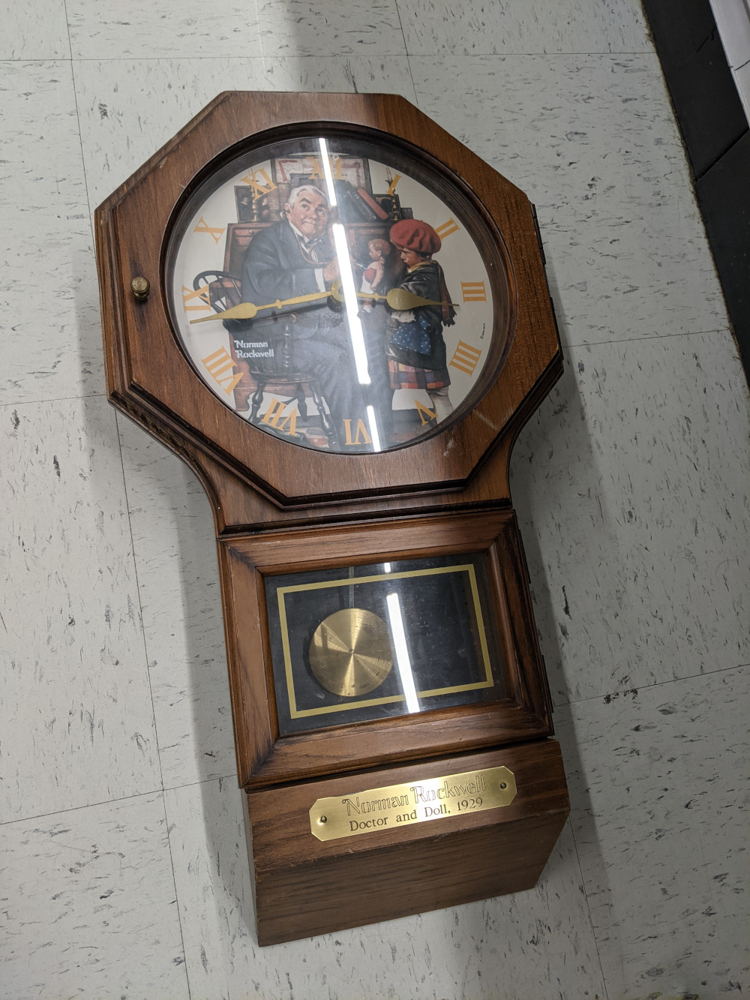

<h1 align="center">Weasley Clock</h1>

<p align="center">
  
</p>

Inspired by the clock in the weasleys house shown in harry potter and the chamber of secrets, this clock shows the location of the members of the house at all times. Location tracking is done through home assistant, and the servo motors are controlled by an ESP8266 D1 mini. 

# Parts

## Electronics

<p align="left">
  
  
</p>

- 28BYJ-48 Stepper Motors & ULN2003 driver boards ($3.80 for two)
  - I got these in [a pack of 5 for $9.49](https://www.amazon.com/gp/product/B015RQ97W8)
  - They come with the driver boards and seem like a really nice cheap stepper motor
  - I mounted the motors via some screws and nuts, and the driver boards with some plastic standoffs that I had extra of from a previous project
- ESP8266 D1 Mini ($4 for one)
  - I got this in [a pack of 3 for $11.99](https://www.amazon.com/gp/product/B08RY2R7KG)
  - ESPs are really nice, and this one happens to be pretty small while still having a convienient micro usb port, and also has a 5v out pin, which i needed for powering the servo motor driver boards
  - It's mounted to the base plate with a super strong double-sided tape (it doesnt have any nice holes for standoffs)
- Wiring
  - I used some plug jumper wires to connect everything. Its a bit messy, and the plugs are a bit too long for the pins, so its a pain to get them to connect properly. I just cut the wires in half and soldered them to the esp. They worked out to be a decent length. I need a better soldering iron.


## Mechanical parts

I was lucky enough to have my dad help me with this project who has a machine shop and a lifetime of experience and was an excellent resource for both designing and fabricating parts. 

<p align="left">
		
		
</p>

- Base Plate
  - This is an aluminum baseplate that holds all the electronics
  - Basically just had a bunch of holes drilled to it and was cut to size
  - I attached it to the clock by gluing some 1" plywood spacers on the walls of the clock and screwing into those
- Steel Rod
  - This is the central axle and hand 1 is connected to it
  - A pretty deep notch was made in it so that the set screw could lock into it without sticking out of the outside of its housing
  - Gear 2 rides on this rod but isn't bound to it
- 2 Plastic gears
  - I have a bag of gears I've scavenged from broken printers and things
  - I took two gears that had a long hollow shaft and modified them to fit my needs
- A Brass motor mount for stepper motor 1
  - Brass machined on a lathe, set screws drilled on milling machine, tapped by drill
  - This one is a brass tube with 2 set screws, one to lock it to the motor axle, and the other to lock it to the steel rod
- A Brass motor mount for stepper motor 2
  - Brass machined on a lathe, set screws drilled on milling machine, tapped by drill
  - Has a set screw to attach it to the motor axle
  - The other end was knurled and then pressed into gear 2
- 2 Brass fittings for the clock hands
  - Brass machined on a lathe, set screw drilled on milling machine, tapped by drill
  - Has a set screw to attach it to their respective axles (steel rod for hand 1, and gear 1 for hand 2)
  - Attached to the clock hand by having a thin tube that extends through the clock hand that we then pressed with a ball bearing in a vice to lock it into place
- The clock hands
  - These are made from aluminum
  - I drew out a rough shape to the correct size via gimp, printed it out, and taped it to the aluminum
  - We didn't have a band saw available so I roughly cut these out using a mechanical punch, and then smoothed out the edges using a scotchbrite wheel
  - They were spray painted black and then the letters were drawn on with a silver magic marker

## Clock



I found this clock at goodwill for $10, and it seemed perfect as a starting place so that I wouldn't have to build an enclosure and stuff myself. I modified it a bit, obviously by adding the electronics and mechanism and new hands, in addition to some holes and attachment points. 

The only other big modification I made to it was to the clock face, which I completely redesigned in GIMP, trying to loosely base it off of the one in the movie. I started with a "parchment" image from wikipedia commons, and just modified it from there, using a font called "lumos" for the text. The gimp project file is [clockface.xcf](/clockface.xcf) if youre curious.


After creating the image, I printed it out and glued it to the old clock face, which worked perfectly.

# Code

There was actually a pretty minimal amount of code for this project, most of the work was in building the mechanism and getting everything to fit together right. As most of the projects i work on are pure-software, this was a bit challenging for me but I definetly enjoyed when I got to work on the code.

## ESP

I programmed the ESP8266 D1 Mini via the Arduino IDE. The code for this is in [weasleyclock.ino](/weasleyclock.ino). Theres not anything super exciting in there, but basically it sets up a web server that listens on a few different endpoints, and then controls the stepper motors based on what gets sent to those endpoints. These are the currently implemented endpoints:
- `/` <br>
  This is just the base url and it shows information about the motor's current position
- `/moveHand` <br>
  You pass this one a json object like `{ "hand": 1, "position": 6 }`, and it will move the motor so the given hand is pointing at that clock position. "hand" is either 1 or 2, and "position" is a clock position (0-12). It also supports "location" instead of "position" and you can give it things like "lost" or "home".
- `/stepHand` <br>
  This one is for making minute adjustments if desired. You pass it a json object like `{ "hand": 1, "position": 6 }`

I tested these endpoints mostly just using curl like this (where 192.168.0.120 is the local ip of the ESP):
```
curl -i -X POST -d '{ "hand": 1, "position": 6 }' 192.168.0.120/moveHand
```

The libraries used are:
- **ESP8266WiFi** - for connecting to wifi
- **ESP8266WebServer** - for serving the http server
- **AccelStepper** - for controlling the stepper motors
- **ArduinoJson** - for parsing the json objects

Note also that for the WIFI name and password, I stored those in a separate file called `config.h`, which just looked like this:
```cpp
#define WIFI_SSID "wifi name here"
#define WIFI_PASSWORD "wifi password here"
```

## Home Assistant

I decided to use home assistent for the "backend" of this project because I already had one set up and wanted to do some more stuff with it and learn how to use it for things like this. I was disappointed with the lack of code sharing that seems to be available, and ended up duplicating a bunch of code for the "sensor" stuff that I ended up using. There might be a better way to do this but I couldn't find a way that would be lightweight but also fix this duplication problem.

I started out by setting up my home assistant app on my phone so that it was reporting its location back. Home assistant has a nice default way of doing this where it reports back the information and stores it in a "device_tracker" entity. By default home assistant tries to assign the "state" of the device_tracker entity to one of the zones that you configure, and if it doesn't fit any of the zones, it gives it a state of not_home. 

I decided to set up a bunch of different zones, and then went forward with the next step, which was making a "sensor" that would be dependant on this "device_tracker" entity. This would allow me to group zones together and also add some functionality to detect if I'm moving. The extra stuff with "speed_timestamp" was added because i wanted it to have a 5 minute timeout before it goes from "travelling" to "lost", so that if your speed goes to 0 while driving, it doesn't instantly assume you're no longer travelling. I chose 5mph for the speed threshold because I want this to work with bike rides. Shown below is the "sensor" yaml code that I added to my `configuration.yaml`. Note that I had to create a duplicate of this code, and just change the sensor_id and device_id for the second person.

```yaml
sensor:
  - platform: template
    sensors:
      malcolm_clock_location:
        friendly_name: "Malcolm's Location"
        value_template: >-
          
          

          
          
          
          
            home
          
            work
          
            store
          
            family
          
            travelling
          
            lost
          
        attribute_templates:
          speed_timestamp: >-
            
            

            
            
              {{now().timestamp()}}
            
              {{state_attr(sensor_id, "speed_timestamp")}}
            
```

Once this was set up, home assistant was automatically tracking what "clock_location" I'm at, and all that was left was to add the automation for triggering the ESP to move the hands. The first step for this was adding a "rest_command" service to my `configuration.yaml`. (note that 192.168.0.120 is the local ip of the ESP)

```yaml
rest_command:
  trigger_clock:
    url: http://192.168.0.120/moveHand
    method: POST
    headers:
      accept: "application/json, text/html"
    payload: '{"hand": "{{ hand }}","location": "{{ location }}"}'
    content_type:  'application/json; charset=utf-8'
```

After adding that, the last thing to do was to add an automation to automatically trigger the rest_command when the entity got updated. Note that again, I had to do this twice, one for each person. I set those up via the GUI but the code for one of them (copied from my `automations.yaml`) looks like this:

```yaml
- id: '1625814840761'
  alias: Weasley Clock (Malcolm)
  description: ''
  trigger:
  - platform: state
    entity_id: sensor.malcolm_clock_location
  condition: []
  action:
  - service: rest_command.trigger_clock
    data:
      hand: 2
      location: '{{ states("sensor.malcolm_clock_location") }}'
  mode: single
``` 

# Inspiration

This project was inspired by [this reddit post](https://www.reddit.com/r/homeassistant/comments/nyp8t2) I saw which implemented a basic version of a harry potter themed location viewing thing for home assistant. I'd just started to use home assistant, my girlfriend is a massive harry potter fan, and her birthday was coming up soon, so I had the idea to make a physical clock that has hands that point in a similar way to the one seen in harry potter and the chamber of secrets.

I started by investigating to see what other people had made first, and the first thing I came across, was [this project](https://github.com/malcolmrigg/WizardClock) which implemented the clock as a lovelace card that was a nice way to view the locations as a clock from within home assistant. On further investigation I found a few examples of physical clocks people had implemented that matched what i was looking for or were similar:
- [Stepper Motor Clock](https://www.youtube.com/watch?v=_yhyu2qyVAw)
- [Magic-Clock](https://github.com/brgerig/Magic-Clock)
- [Weasley Clock](https://old.reddit.com/r/homeassistant/comments/iz1xfx)

I didn't use any of the code or design from these but they were good inspiration and helped me with thinking about what parts to use etc.


# If I had more time

I was running out of time (finished building it the night before the birthday) so there were definetly some things that could be improved/added if I had more time to work on it. Some of these I could still add even though the project is "finished", but if theyre still on this list I haven't added them yet.

- Fix clock face
  - The T of Travelling is cut off a bit
  - The bottom 3 locations could have the text flipped around so theyre more readable
- Design hands better
  - I was running out of time when designing the hands, so these are my first draft
  - Ideally I'd like to be able to laser cut them out of wood similar to how i saw it done in [this](images/example_clock.jpg) image i found (dont think this clock actually works)
  - Also it could've been good to put pictures on the circles instead of the letters if I found a way to frame them nicely
- Make it battery powered
  - Currently its got a wire coming out of it which isn't ideal for hanging things on walls.
  - Ideally I could make a bank of rechargable batteries that I replace/recharge every so often to keep it running.
- Add a magnet thing so the servos could self-zero
  - Currently they don't retain memory of their position on restart, so if they aren't facing straight up when theres a power outage I'll have to re-orient them.
  - The fix for this would be to add a little magnet to each hand (or maybe on an inner gear for the 2nd hand) and a magnetic sensor that can check when it gets to that position so on restart it can figure out where it is
- Home Assistant
  - The "backend" code in home assistant that aggregates zone info into location info is just not very pretty and I hate how I have 2 sensors that have exactly the same code written twice. I'm not sure if theres a better way to do it in home assistant but there should be
  - I put the code for converting location info to clock position in the ESP because of the lack of functions and calling home assistant code from multiple places, but maybe theres a better way to do it, so I could have that code on the backend and be able to change it more easily if i wanted to.
  - I could honestly move all the home assistant logic into a custom server and it would be a lot cleaner, but I wanted to learn home assistant stuff, so ¯\\\_(ツ)\_/¯
- Add a nice webpage to be served by the ESP
  - Could have stuff like buttons on it that you can use to adjust the hands
  - Could also just have an html version of the clock on it
- Add a card to home assistant
  - Shows a js rendered version of the clock, can use the same clockface image

